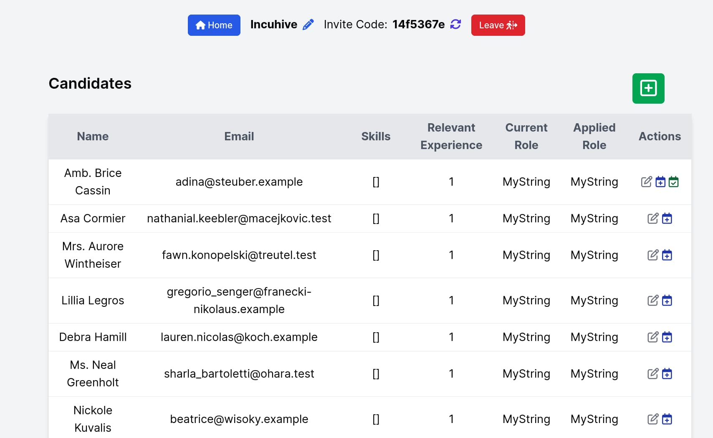

<div align = "center">

<h1><a href="https://github.com/incubyte/incuhive">Incuhive</a></h1>

<a href="https://github.com/incubyte/incuhive/blob/main/LICENSE">
 </a>

<a href="https://github.com/incubyte/incuhive/graphs/contributors">
 </a>

<a href="https://github.com/incubyte/incuhive/stargazers">
</a>

<a href="https://github.com/incubyte/incuhive/network/members">
 </a>

<a href="https://github.com/incubyte/incuhive/watchers">
 </a>

<a href="https://github.com/incubyte/incuhive/pulse">
 </a>

<h3>Easy to use hiring platform 💼🐝</h3>

<figure>
  
  <br/>
  <figcaption>incuhive in action</figcaption>
</figure>

</div>

Incuhive is a hiring platform that helps you simplify the hiring process.

## ✨ Features

-
- Works with [mkrepo](https://github.com/incubyte/mkrepo)

## ⚡ Setup

### ⚙️ Requirements

- Ruby version: 3.2.0

### 🛠️ Development

You need to follow the following steps to setup incuhive development on your local machine:

```bash
git clone https://github.com/incubyte/incuhive
cd incuhive
```

- Install dependencies: `bundle install`
- Database setup: `bundle exec rails db:setup`
- Run dev server: `bin/dev`, this runs `Procfile.dev` using `foreman`:
  - server: `bundle exec rails server`
  - tailwind: `bundle rails tailwindcss:watch`
  - watcher: `bundle exec guard`
- Run tests: `bundle exec rspec`
- Run formatter: `bundle exec rubocop -A`

## 🏗️ What's Next

Check out the [issues](https://githiub.com/incubyte/incuhive/issues) to see what's next, or open requests for new features.

## 🧑‍💻 Behind The Code

### 🌈 Inspiration

We wanted to centralize information about hiring and make it easier for everyone helping with hiring.

<hr>

<div align="center">

<strong>⭐ hit the star button if you found this useful ⭐</strong><br>

<a href="https://github.com/incubyte/incuhive">Source</a>
| <a href="https://incubyte.github.io/blog" target="_blank">Blog </a>
| <a href="https://twitter.com/incubyte" target="_blank">Twitter </a>
| <a href="https://linkedin.com/in/incubyte" target="_blank">LinkedIn </a>
| <a href="https://incubyte.github.io/links" target="_blank">More Links </a>
| <a href="https://incubyte.github.io/projects" target="_blank">Other Projects </a>

</div>
